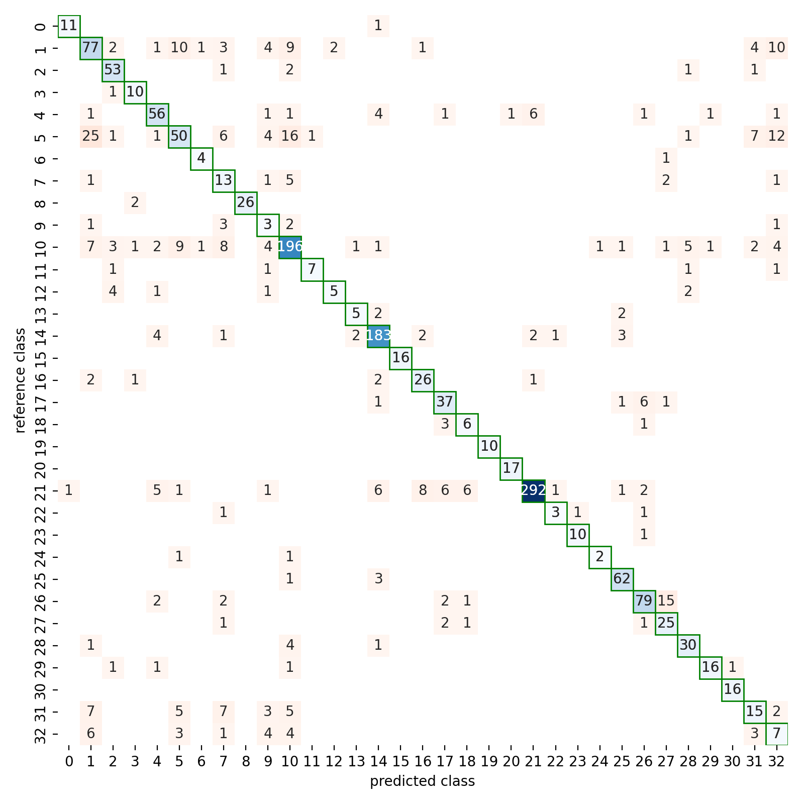

# Using PointNet++ to classify species in point clouds of single trees

This repository holds the code and instructions for a submission to the [Sensor-agnostic tree species classification using proximal laser scanning (TLS, MLS, ULS) and CNNs 🌳🌲💥🤖](https://github.com/stefp/Tr3D_species) hosted by the COST Action CA20118 ("3DForEcoTech").

This submission uses [PointNet++](https://github.com/charlesq34/pointnet2) with some adaptations for topographic point clouds, namely

- rotational augementation limited to the Z-Axis (vertical axis)

- sampling method to create point clouds of equal size (~32k points per sample)

- weighted loss calculation to account for class imbalance

The starting point for the code was the [PointNet++ Classification implementation by the pytorch-geometric team](https://github.com/pyg-team/pytorch_geometric/blob/master/examples/pointnet2_classification.py).

For the leaderboard in the challenge, please visit [stefp's repository hosting the challenge](https://github.com/stefp/Tr3D_species#leader-board).

## Training performance

To tune the hyperparameters of the network, a validation set was created, amounting to 10% of the training set. The 10% were chosen randomly from each class, to ensure that every class also has samples in the validation set. No separate test set was created, as this is governed by the challenge. The train/validation split was the same as the one used by [Brent Murray](https://github.com/Brent-Murray/TR3D_PointAugDGCNN).

## Tunable and tuned hyperparameters

The network comes with a number of tunable hyperparameters. An incomplete list follows below to give an idea of options to change the method.

- Number of Set Abstraction layers in PointNet++

- Number of neurons and layers in the MLPs of PointNet++

- Optimizer and its parameters, learning rate

- Loss function and esp. different weights

- Training data augmentation

- Batch size

- Point sampling strategies, handling of small point clouds (<16k points)

We trained the NN with different settings for all of these parameters, and observed the performance in macro F1 scores. The model with the best performance on the validation data during the training loop (not necessarily the last model) was selected.

## Running training phase

To start the training, run the code provided in `tree_classification.py`. The code assumes that the training data is provided in a subfolder called `COST-Challenge`, which contains the CSV file pointing to the point clouds: The 2nd column should be the species (or id), the 7th column should be the filename relative to a `train` subfolder in the `COST-Challenge` folder, and the 9th column should be either 'train' or something else (e.g. 'test', 'validation') to define the train/validation split. This is provided in the repository in the `COST-Challenge/tree_metadata_training_publish_BM.csv` file.

## Running inference

To run the model on new data, ensure to download the weights of the model provided [here](best.model). Then, change the parameters in `tree_classification_inference.py` to fit your input data (paths, path to the model) and run it.

This code assumes you have a GPU with CUDA enabled. It has been tested on Windows.

## Validation results and parameters
Find the parameter settings and the validation results for the submitted model below:

| Parameter        | Setting           | Comment                |
|------------------|-------------------|------------------------|
| Optimizer        | Adam              |                        |
| Learning Rate    | 0.0001            | (1e-4)                 |
| Augmentation     | Rotation (6-fold) | 60 deg rotations       |
| Number of points | 16,384            |                        |
| Batch size       | 16                |                        |
| No. of epochs    | 100               | Best model at Epoch 54 |

| Metric           | Score  |
|------------------|--------|
| Mean training loss| 0.3723 |
| Mean validation loss| 0.7300 |
| F1 validation    | 0.7761 |
| Precision validation|  0.7899      |
| Recall validation       |  0.7724      |
| Macro accuracy validation    |  77.24%    |

Confusion matrix for the validation set:

